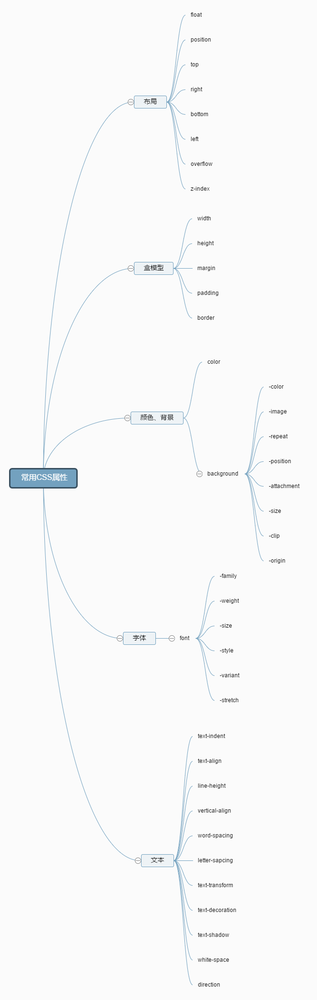

Nicholas C.Zakas (《JavaScript高级程序设计》的作者)说过，要想全面理解和掌握JavaScript，关键在于弄清楚它的历史、本质和局限性。对CSS同样适用。

####**历史**
混沌未分天地乱，CSS的诞生就是为了终结当时由推动Web世界繁荣的首功之臣HTML引发的混乱局面。
在1990~1993年Web世界还处于一片荒凉的时候，HTML这个勤劳而艰难生存的族群带着描述段落、标题、超链接等结构性内容（后来这些成员荣升HTML国的贵族，经过几次战乱并一直生活到现在）的技能给Web世界带来了生机。而后 Mosaic（早期的一款浏览器）的出现让文字和图片可以一起显示出来，也一夜之间让Web威名远扬，这里充满魔力与神奇。无数的站点冒了出来，无数的站点吸引无数的人，无数的人带来无数的新功能，我要字体能变色，我要字体能加粗，HTML为了满足不断膨胀的欲望和要求努力扩充技能树，最后弄得自己苦不堪言，一大堆描述样式的标签（现在还有的`<i><em>`等)搞得开发乱七八糟。

结构化标记语言就这样变成了一坨一坨的字符串。

刚成立的Web世界联合国W3C并没有坐视不管，而是在积极的寻找与焦急的等待。终于他们找到了CSS。
CSS在现在Web开发中可谓平淡无奇，写CSS是很自然的事情因为它就属于开发的一部分，但在当时却是绝无仅有的。它最初由

[Håkon Wium Lie](https://en.wikipedia.org/wiki/H%C3%A5kon_Wium_Lie) 

于1994.10.10（他当时是Tim Berners-Lee在CERN的同事，Lee发明了万维网）提出来，由[Bert Bos](https://en.wikipedia.org/wiki/Bert_Bos)建议，经过W3C的公开和内部讨论最终在1996年底推出CSS1，使之成为标准被推荐，很快浏览器厂商也争相在自家产品中实现以占领市场。这中间也并非一帆风顺，比如网景公司就提交了一种新语言JSSS来实现样式，但最终并没有被接受（这种开发标准之争一直存在，后来的JavaScript，以及现在开发中的很多新技术都是这样）。

CSS接过了HTML手中的样式表现接力棒，也开始了自己的传奇之旅。

####**本质**
CSS的本质可以分为宏观与微观两方面。
宏观上它的存在就是为了控制页面的显示样式。包括布局，颜色，字体等。
微观上则是实现这种控制功能的各种属性的定义和工作原理。
知道定义就能干活，知道原理才能把活干好。
题主说属性太多，其实CSS就是去控制样式而已，网页样式是借鉴于传统的报纸等印刷品的排版。你随便在身边找一份报纸或者杂志的一页，用CSS尽可能的还原出来。整体布局还原出来问题应该不大，但是具体到细节的时候可能会有很多问题，比如出来的效果总是跟想的不一样。这个时候就该去看看单个属性的工作原理，比如margin是用来控制外边距的但是用%的时候它是怎么计算的最终值呢？(margin的%总是是基于父容器的宽，不管是margin-top还是margin-left)。当发现出乎意料的时候就去[css attributes index](https://www.w3.org/TR/2011/REC-CSS2-20110607/indexlist.html)查一下属性的定义和值的计算方法。

* 常用CSS属性margin和padding的%取值是基于包含块（离元素最近的块级祖先元素）的宽。
* 行内元素中的内容区、行内框、基线这几个概念很重要。
* inline-block的解析是，内部被解析为块级元素，自身被解析为行内元素。
* background-image可以同事为一个元素设置多个背景图配合background-position可以组合出神奇的效果。
* 浮动的元素会消除外边距重合，浮动的元素会被解析为块级元素。
* top,right,bottom,left,z-index这些属性只能用在定位元素(除了static的)上才有效。
* overflow的值设置为scroll，在移动端可以做横向滑动效果。
* 除了做表格不要用table布局。
* 选择器都很简单，只说一类。结构伪类选择器，原理可以理解为先找到符合条件的元素后，向上找到其父元素然后验证规则。
####**局限性**
更新中...
####**番外篇**
1. CSS推荐书写顺序（部分，完整稍后）

浏览器读到CSS之后会边解析，边渲染。所以好的书写顺序不光让代码一致性更好，更重要的是提升性能。
推荐顺序是按照影响力大小依次向下，可以简单分为布局，盒模型，文字排版，视觉效果等。[声明顺序简单介绍](http://codeguide.bootcss.com/#css-declaration-order)。这样后面的代码在解析的过程中不会影响到已经解析渲染过的页面样式。

